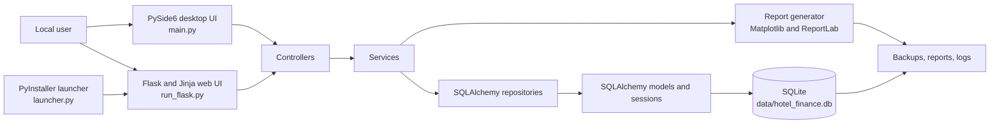
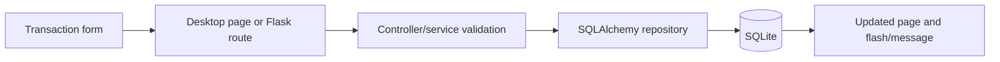
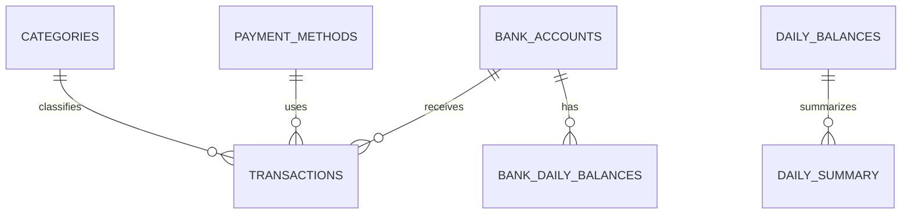

# Hotel Finance Manager

A local hotel finance tracker for recording transactions, monitoring cash and online balances, and producing monthly reports.

## Table of Contents

- [Overview](#overview)
- [Features](#features)
- [Technology Stack](#technology-stack)
- [Architecture](#architecture)
- [Data Flow](#data-flow)
- [Requirements](#requirements)
- [Installation](#installation)
- [Configuration](#configuration)
- [How to Run](#how-to-run)
- [Usage](#usage)
- [Project Structure](#project-structure)
- [Web Routes and Communication](#web-routes-and-communication)
- [Database](#database)
- [Authentication and Security](#authentication-and-security)
- [Error Handling and Validation](#error-handling-and-validation)
- [Testing](#testing)
- [Screenshots](#screenshots)
- [Troubleshooting](#troubleshooting)
- [Known Limitations](#known-limitations)
- [Future Improvements](#future-improvements)
- [Development Guide](#development-guide)
- [Contributing](#contributing)
- [License](#license)
- [Acknowledgements](#acknowledgements)

## Overview

Hotel Finance Manager is a local-first bookkeeping application for hotel operations. It provides two interfaces over the same SQLAlchemy and SQLite data layer:

- A PySide6 desktop application with dashboard, transactions, cash management, settings, and report pages.
- A Flask web application rendered with Jinja templates and intended for local browser use.

The application records income and expense transactions, separates cash from online payments, tracks bank accounts and daily balances, manages hotel information, calculates cash denominations, creates monthly PDF reports, and supports SQLite backup and restore. It is designed for a trusted local workstation; multi-user authentication is not implemented.

## Features

### Finance Operations

- Record and delete income and expense transactions.
- Associate transactions with categories and the seeded `Cash` or `Online` payment methods.
- Require an active bank account for online transactions.
- Search transactions by category, payment method, description, or amount.
- Filter transactions by income or expense.
- View daily income, expense, profit, transaction counts, and highest-value transactions.

### Cash and Banking

- Set daily cash and online opening balances.
- Calculate closing balances from opening balances and transactions.
- Count denominations from Rs 500 through Rs 1 and calculate their total.
- Add, edit, and deactivate online bank accounts.
- Set per-account daily opening balances and view account summaries and daily transactions.

### Categories, Hotel Information, and Settings

- Create income and expense categories.
- Prevent deletion of categories that are used by transactions.
- Store hotel name, address, phone number, email, and GSTIN.
- Add and delete custom name/value fields.
- Configure the application name and theme through `.env`.

### Reports and Data Protection

- View monthly income, expense, profit, transaction count, category totals, and daily totals.
- Export a monthly PDF containing summaries, charts, category analysis, daily data, and hotel information.
- Create timestamped SQLite backups.
- Restore a readable SQLite database after structural validation.

## Technology Stack

| Category | Technology | Version or implementation | Purpose |
| --- | --- | --- | --- |
| Language | Python | Not pinned by the repository | Application runtime |
| Desktop UI | PySide6 | 6.11.1 | Native desktop interface |
| Web backend | Flask | Not directly pinned in `requirements.txt` | Local server-rendered web interface |
| Templates | Jinja2 | Flask dependency | HTML rendering |
| ORM and database access | SQLAlchemy | 2.0.51 | Models, sessions, repositories, and queries |
| Database | SQLite | Via Python SQLite driver | Local persistent storage |
| Charts and PDF | Matplotlib, ReportLab | 3.7.1, 5.0.0 | Report charts and PDF generation |
| Configuration | python-dotenv | 1.2.2 | Loading `.env` values |
| Packaging | PyInstaller | 6.21.0 | Windows distribution build |
| Testing dependency | pytest | 9.1.1 | Listed dependency; no tests are included |
| Code quality tools | Black, Flake8 | 26.5.1, 7.3.0 | Listed development dependencies |

The complete pinned dependency set is in [`requirements.txt`](requirements.txt). Flask itself is imported by the application but is not version-pinned in that file.

## Architecture

The desktop and web interfaces share the application and persistence layers. The Flask application does not expose a JSON REST API or socket protocol; it returns HTML pages and uses form POSTs followed by redirects.



At startup, `app.core.app.run()` creates a `QApplication`, creates any missing tables, seeds required payment methods, and opens `MainWindow`. `flask_app.create_app()` performs the same database initialization and registers six Flask blueprints. `launcher.py` starts that Flask app in a daemon thread, waits for `127.0.0.1:5000`, and opens the browser.

## Data Flow

### Transaction Creation

1. A user submits the transaction form in the desktop or web interface.
2. The relevant view or Flask route reads the category, payment method, amount, date, time, description, and optional bank account.
3. The controller and service layer validate the operation. Online transactions must reference an active bank account.
4. A SQLAlchemy `Transaction` is persisted through the repository/session layer.
5. The interface refreshes its transaction list and summary values. Web requests return a redirect and a flash message.



### Daily Cash and Reporting

Daily cash pages load opening balances and aggregate transactions by payment method. Closing values are calculated as opening balance plus income minus expense. Denomination counts are multiplied by their configured denominations and stored with a calculated total. Monthly reports query transaction aggregates, render the HTML report page, or pass the results to the PDF generator for download.

### Backup and Restore

The backup repository uses SQLite's online backup API to write timestamped files under `backups/`. Restore uploads or selects a database, checks that it is readable and contains at least one table, copies it into the configured database, removes SQLite WAL/SHM sidecar files, and returns a success or error message to the interface.

## Requirements

### Operating System

Windows is the primary supported deployment target because the repository includes a Windows console handler and PyInstaller launcher. The source code does not declare a formal minimum operating-system version.

### Runtime and Tools

- Python: exact required version is not specified in the repository. The checked-in build artifacts indicate Python 3.11 was used for one build, but this is not a declared requirement.
- `pip` and a Python virtual environment.
- Git for source checkout.
- A browser for the Flask interface.
- PyInstaller only when building the packaged distribution.

## Installation

The repository does not specify a public Git remote URL. After obtaining the repository, create an isolated environment and install the pinned dependencies:

```powershell
git clone <repository-url>
cd HotelFinance
py -m venv .venv
.\.venv\Scripts\Activate.ps1
python -m pip install --upgrade pip
python -m pip install -r requirements.txt
```

The application creates `data/` and `backups/` automatically. It also creates the SQLite tables and seeds the `Cash` and `Online` payment methods on startup, so no separate migration command is required. No environment variables are required for the default configuration.

## Configuration

Configuration is loaded from a `.env` file beside `config.py` when running from source. When packaged, the base directory is the directory beside the executable. The checked-in `.env.example` is empty, so the following are the complete variables implemented by `config.py`:

| Variable | Required | Description | Example |
| --- | --- | --- | --- |
| `APP_NAME` | No | Application name configuration; defaults to `Hotel Finance Manager` | `APP_NAME=Hotel Finance Manager` |
| `APP_THEME` | No | Theme configuration; defaults to `dark` | `APP_THEME=dark` |

The database and file locations are not environment-configurable:

- Database: `data/hotel_finance.db`
- Backups: `backups/`
- Log file: `logs/hotel_finance.log`
- Web host: `127.0.0.1`
- Web port: `5000`

The Flask secret key is hard-coded in `flask_app/__init__.py` and is used for Flask flash-message sessions. It is not read from an environment variable.

## How to Run

### Desktop Application

```powershell
python main.py
```

This opens the PySide6 desktop window and loads the dark Qt stylesheet from `styles/dark.qss`.

### Flask Web Application

```powershell
python run_flask.py
```

Open [http://127.0.0.1:5000](http://127.0.0.1:5000) in a browser. The source entry point runs Flask with `debug=True` and `use_reloader=False`; this is a development server configuration.

### Packaged Windows Application

Build from the repository root with:

```powershell
pyinstaller HotelFinance.spec
```

The spec uses `launcher.py`, collects templates, static files, styles, and `.env`, and produces a console-enabled `HotelFinance` distribution under `dist/HotelFinance` when the build succeeds. The launcher starts the local Flask server and opens the browser automatically. The exact generated layout is controlled by the installed PyInstaller version.

## Usage

1. Start either the desktop application or the Flask application.
2. Add the hotel's information in Settings.
3. Create the income and expense categories used by the business.
4. Add bank accounts before recording online transactions.
5. Set daily opening balances on the Cash or Bank Accounts pages.
6. Record and review transactions from Transactions.
7. Use the Dashboard for daily totals and Cash for cash counts and closing calculations.
8. Select a month under Reports to inspect totals, category breakdowns, daily rows, or export a PDF.
9. Create a backup or restore a validated SQLite database from Settings.
10. Close the desktop window or stop the Flask process to exit.

## Project Structure

```text
HotelFinance/
├── main.py                         # PySide6 desktop entry point
├── run_flask.py                    # Flask development entry point
├── launcher.py                     # Packaged local Flask launcher
├── config.py                       # Paths and .env configuration
├── requirements.txt                # Pinned Python dependencies
├── HotelFinance.spec               # PyInstaller build definition
├── app/
│   ├── core/                       # Desktop application startup/constants
│   ├── controllers/                # UI-facing orchestration and validation
│   ├── database/                   # Engine, sessions, initialization, repositories
│   ├── enums/                      # Category and payment method enums
│   ├── models/                     # SQLAlchemy ORM entities
│   ├── services/                   # Business operations and PDF generation
│   ├── utils/                      # Logging and backup helpers
│   ├── views/                      # PySide6 window, pages, widgets, dialogs
│   └── workers/                    # Background restore worker
├── flask_app/
│   ├── routes/                     # Flask blueprints and form handlers
│   ├── templates/                  # Jinja HTML templates
│   └── static/                     # Web CSS
├── styles/                         # Qt stylesheets and color definitions
├── data/                           # Runtime SQLite database, created as needed
├── backups/                        # Runtime SQLite backups
├── reports/ and exports/           # Generated-output locations
├── logs/                           # Runtime logs
└── check_cash_denom_table.py       # SQLite inspection utility
```

## Web Routes and Communication

The Flask interface is a server-rendered HTML application. Routes use normal browser navigation, HTML form submissions, redirects, and Flask flash messages. There are no JSON API endpoints, WebSockets, raw sockets, or client/server authentication protocol in the repository.

| Method | Endpoint | Purpose |
| --- | --- | --- |
| GET | `/` | Daily dashboard |
| GET | `/transactions` | Transaction list, search, and filters |
| POST | `/transactions/add` | Create a transaction |
| POST | `/transactions/delete/<transaction_id>` | Delete a transaction |
| POST | `/categories/add` | Create a category |
| POST | `/categories/delete/<category_id>` | Delete an unused category |
| GET | `/cash` | Cash and online daily balances |
| POST | `/cash/opening-balance` | Save daily opening balances |
| POST | `/cash/denominations` | Save cash denomination counts |
| GET | `/reports` | Monthly report page |
| GET | `/reports/export-pdf` | Download a monthly PDF report |
| GET | `/settings` | Settings, custom fields, and backup controls |
| POST | `/settings/hotel` | Save hotel information |
| POST | `/settings/custom-field` | Add a custom field |
| POST | `/settings/custom-field/<field_id>/delete` | Delete a custom field |
| POST | `/settings/backup` | Create a database backup |
| POST | `/settings/restore` | Restore an uploaded SQLite database |
| GET | `/bank-accounts` | List accounts and daily summaries |
| GET | `/bank-accounts/<account_id>` | Show account details and today's transactions |
| POST | `/bank-accounts/add` | Add an account |
| POST | `/bank-accounts/<account_id>/edit` | Edit an account |
| POST | `/bank-accounts/<account_id>/deactivate` | Soft-deactivate an account |
| POST | `/bank-accounts/<account_id>/opening-balance` | Set an account's daily opening balance |

Query parameters used by the web interface include `q` and `type` on `/transactions`, and `month` and `year` on `/reports` and `/reports/export-pdf`.

## Database

SQLite is accessed through a SQLAlchemy engine configured with an absolute path and `NullPool`. SQLite foreign-key enforcement is enabled for each connection. Startup runs `Base.metadata.create_all()` and lightweight compatibility upgrades for missing settings columns and `transactions.bank_account_id`; there is no versioned migration framework.

### Tables and Relationships

| Table/model | Stored information |
| --- | --- |
| `business` | Business name, owner, contact details, address, currency, timestamps |
| `categories` | Unique category name and `Income` or `Expense` type |
| `payment_methods` | Payment method name and active state; startup seeds `Cash` and `Online` |
| `transactions` | Amount, description, date/time, category, payment method, optional bank account |
| `daily_balances` | Daily cash and online opening balances |
| `daily_summary` | Daily opening, closing, expected, and actual cash values |
| `cash_denominations` | Daily counts for Rs 500, 200, 100, 50, 20, 10, 5, 2, and 1 plus total |
| `cash_notes` | Date, denomination, and count |
| `custom_fields` | Unique user-defined name/value pairs |
| `settings` | Theme, backup options, and hotel information |
| `bank_accounts` | Account name, optional account number, and active state |
| `bank_daily_balances` | Daily opening balance per bank account |



`transactions.category_id`, `transactions.payment_method_id`, and nullable `transactions.bank_account_id` are the principal transaction relationships. Categories and payment methods retain transaction relationships; bank accounts are deactivated rather than deleted from normal web management.

## Authentication and Security

No registration, login, password hashing, token, session-based user identity, or authorization mechanism is implemented. All registered routes are available to anyone who can reach the Flask process.

Implemented protections and operational details include:

- The packaged launcher binds to `127.0.0.1`, which normally limits access to the local machine.
- SQLAlchemy ORM queries are used for application database operations.
- Jinja templates use Flask's normal autoescaping behavior.
- Restore input is written to a temporary file, checked as a readable SQLite database with at least one table, and removed afterward.
- Foreign-key enforcement is enabled on SQLite connections.
- Unexpected desktop errors are logged and shown through generic Qt message boxes; web errors are logged and shown through generic flash messages.

### Security Considerations

This application should be treated as trusted-local software unless it is hardened before network deployment. The Flask secret key is hard-coded, POST forms do not include CSRF protection, and `run_flask.py` enables Flask debug mode. Do not expose that development server to an untrusted network or use real secrets in the repository.

## Error Handling and Validation

The application validates or handles the following cases:

- Transaction amounts must be greater than zero through the controller/service layer.
- Online transactions require a valid active bank account.
- Category names and category types are validated.
- Bank account names are required and unique case-insensitively.
- Bank opening balances cannot be negative.
- Hotel name is required and email uses a basic format check.
- Custom field names and values are required and unique.
- Categories used by transactions cannot be deleted.
- Restore files must be readable SQLite databases containing at least one table.
- SQLAlchemy repository failures roll back the active transaction.
- Flask handlers redirect with success/error flash messages; desktop handlers log failures and display message boxes.

Known validation gaps include cash opening balances and denomination counts being parsed without explicit non-negative server-side checks, and several web monetary inputs being converted through `float` before persistence.

## Testing

`pytest==9.1.1` is listed in `requirements.txt`, but no `tests/` directory, test files, or test configuration are included. Automated tests are not currently included in this repository.

There is no verified repository test command. After adding tests, the conventional command would be `python -m pytest`, but it is not currently backed by checked-in tests.

## Screenshots

No screenshots, GIFs, videos, or other demo media are currently included in the repository.

## Troubleshooting

### The database is missing

Run either `python main.py` or `python run_flask.py` from the repository root. Startup creates `data/` and `data/hotel_finance.db`, then creates the schema. The configured runtime database is under `data/`, not the root-level `hotel_finance.db` file that is present in this checkout.

### The browser does not open

Open [http://127.0.0.1:5000](http://127.0.0.1:5000) manually. The packaged launcher waits up to 30 seconds for Flask to respond before printing the URL.

### Port 5000 is already in use

The host and port are hard-coded as `127.0.0.1:5000` in `run_flask.py` and `launcher.py`. Stop the conflicting process before starting the application; a runtime port override is not implemented.

### Restore fails

Use a readable SQLite database generated by this application. The restore flow rejects missing, unreadable, or structurally invalid files and reports the failure through a flash message.

### PowerShell blocks activation

Use a process-scoped execution policy for the current terminal, then activate the environment:

```powershell
Set-ExecutionPolicy -Scope Process -ExecutionPolicy RemoteSigned
.\.venv\Scripts\Activate.ps1
```

## Known Limitations

- No authentication or authorization is implemented.
- The Flask server uses a development configuration and a hard-coded secret key.
- POST forms have no CSRF protection.
- The database has automatic table creation and small compatibility upgrades, but no migration framework.
- The configured web host and port cannot be changed through environment variables.
- Automated tests are not included.
- The Python runtime version and public Git remote are not specified in the repository.
- The `auto_backup` setting exists in the model, but no active scheduling workflow was found.
- The `cash_notes` model and repository exist, but no current Flask route visibly uses them.
- Monetary values in parts of the web layer are converted through `float`.

## Future Improvements

The following are suggested future work based on the current implementation, not implemented features:

- Move the Flask secret key to environment configuration and add production deployment settings.
- Add authentication, authorization, CSRF protection, and secure session handling before network use.
- Add automated unit and integration tests for controllers, services, routes, backup/restore, and database initialization.
- Introduce versioned database migrations.
- Centralize strict monetary and non-negative input validation using `Decimal`.
- Add configurable host/port settings and production WSGI deployment documentation.
- Clarify or complete automatic backup scheduling and the `cash_notes` workflow.

## Development Guide

1. Create and activate `.venv`, then install `requirements.txt`.
2. Run `python main.py` for desktop work or `python run_flask.py` for route/template work.
3. Put data-model changes in `app/models/`, database registration/compatibility work in `app/database/`, and business rules in the corresponding controller/service/repository modules.
4. Add desktop pages and widgets under `app/views/`; add web blueprints under `flask_app/routes/` and templates under `flask_app/templates/`.
5. Keep generated database files, backups, logs, reports, and exports out of commits; `.gitignore` already excludes their normal runtime directories.
6. Build the packaged web distribution with `pyinstaller HotelFinance.spec` when validating the Windows bundle.
7. Run `python -m pytest` only after adding or obtaining tests; no test suite is currently present.

The `app/` package is shared by both interfaces, so changes to models, controllers, services, repositories, or configuration can affect desktop and web behavior.

## Contributing

No formal contribution policy is included in the repository. A practical contribution workflow is:

1. Fork or clone the repository.
2. Create a focused feature branch.
3. Make the smallest change that addresses the issue.
4. Run the applicable application flow and any available checks.
5. Commit the change and open a pull request describing behavior and verification.

## License

No license file is currently included in this repository.

## Acknowledgements

The project uses PySide6, Flask, Jinja2, SQLAlchemy, SQLite, Matplotlib, ReportLab, python-dotenv, and PyInstaller. No external API, dataset, or hosted service is referenced by the implementation.
